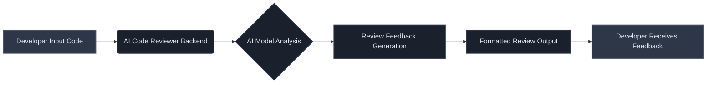
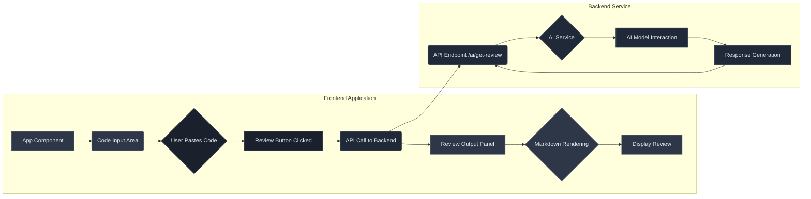
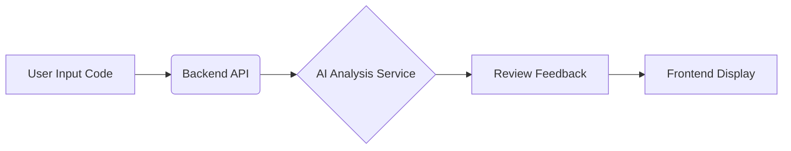
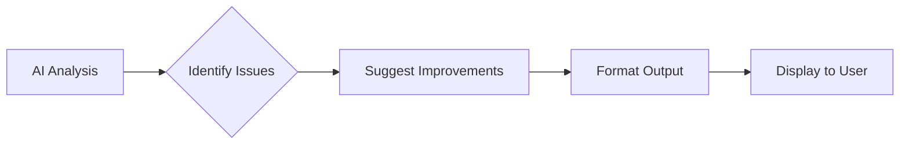
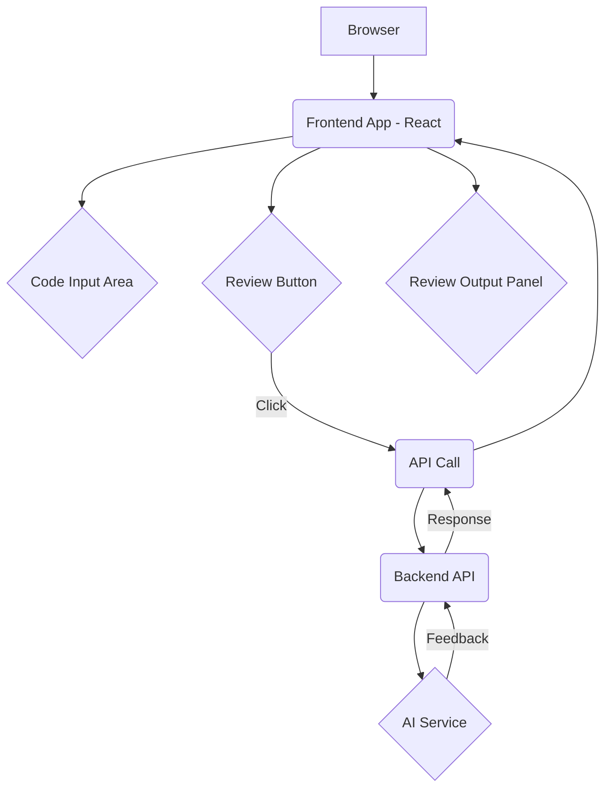
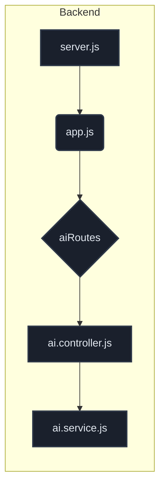
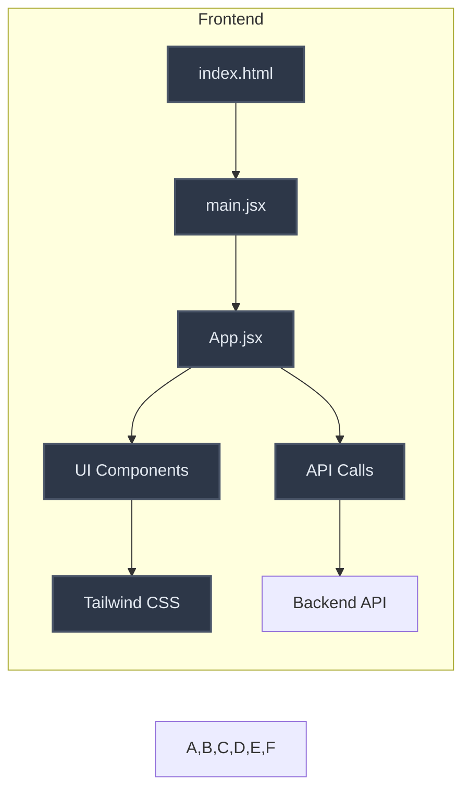
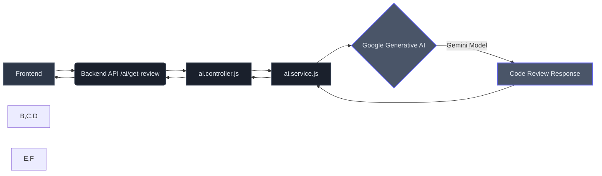

## Project Purpose: AI Code Reviewer

The AI Code Reviewer is an intelligent tool designed to automate and enhance the code review process. It assists developers by identifying potential issues, suggesting improvements, and ensuring adherence to best practices *before* code is deployed.

---

### Core Functionality

The system leverages an AI model to analyze code snippets, providing feedback on quality, efficiency, security, and maintainability.



---

### AI Reviewer Persona & Guidelines

The AI is configured to act as a senior code reviewer with extensive experience. It focuses on providing constructive, actionable feedback.

**Key Review Areas:**

*   **Code Quality:** Cleanliness, maintainability, structure.
*   **Best Practices:** Industry standards, DRY, SOLID principles.
*   **Efficiency & Performance:** Optimization, bottleneck detection.
*   **Error Detection:** Bugs, security risks, logical flaws.
*   **Scalability:** Adaptability for future growth.
*   **Readability & Maintainability:** Clarity and ease of modification.

**Review Guidelines:**

1.  **Constructive Feedback:** Detailed yet concise explanations.
2.  **Code Suggestions:** Offer refactored code or alternatives.
3.  **Performance Bottlenecks:** Identify and suggest fixes.
4.  **Security Compliance:** Detect common vulnerabilities.
5.  **Consistency:** Enforce uniform style and conventions.
6.  **Best Principles:** Adhere to DRY and SOLID.
7.  **Complexity Reduction:** Recommend simplifications.
8.  **Test Coverage:** Verify and suggest improvements.
9.  **Documentation:** Advise on comments and docstrings.
10. **Modern Practices:** Suggest up-to-date techniques.

**Tone:** Precise, to-the-point, balanced strictness with encouragement.

```mermaid
graph TD
    subgraph AI Reviewer Configuration
        A[Senior Code Reviewer Persona]
        B[Focus Areas]
        C[Review Guidelines]
        D[Tone & Approach]
    end

    subgraph Code Analysis
        E[Code Quality]
        F[Best Practices]
        G[Efficiency]
        H[Error Detection]
        I[Scalability]
        J[Readability]
    end

    subgraph Feedback Delivery
        K[Constructive Feedback]
        L[Code Suggestions]
        M[Performance Tips]
        N[Security Alerts]
        O[Consistency Checks]
        P[Principle Adherence]
        Q[Complexity Reduction]
        R[Test Coverage Advice]
        S[Documentation Guidance]
        T[Modern Practice Recommendations]
    end

    A --> B;
    A --> C;
    A --> D;

    B --> E;
    B --> F;
    B --> G;
    B --> H;
    B --> I;
    B --> J;

    C --> K;
    C --> L;
    C --> M;
    C --> N;
    C --> O;
    C --> P;
    C --> Q;
    C --> R;
    C --> S;
    C --> T;

    classDef config fill:#2D3748,stroke:#4A5568,stroke-width:2px,color:#E2E8F0;
    classDef analysis fill:#1A202C,stroke:#2D3748,stroke-width:2px,color:#E2E8F0;
    classDef feedback fill:#1F2937,stroke:#374151,stroke-width:2px,color:#E2E8F0;

    class A,B,C,D config;
    class E,F,G,H,I,J analysis;
    class K,L,M,N,O,P,Q,R,S,T feedback;
```



---

### User Interface Integration

The frontend provides a simple interface for code input and displays the AI-generated review in a clear, readable format.

**Frontend Components:**

*   **Code Input Area:** A `textarea` for developers to paste their code.
*   **Review Button:** Triggers the code review process.
*   **Review Output Panel:** Displays the AI's feedback, rendered using Markdown.



**Example Code Snippet (Frontend Input):**

```jsx
// frontend/src/App.jsx
<textarea
  value={code}
  onChange={(e) => setCode(e.target.value)}
  style={editorStyle}
  className="w-full h-full block"
  placeholder="Paste your code here..."
/>
<button
  onClick={reviewCode}
  disabled={isLoading}
  className={`
    absolute bottom-4 right-4 z-10
    flex items-center space-x-2
    px-6 py-3 rounded-full
    font-bold text-sm tracking-wider
    transition-all duration-300 ease-in-out
    shadow-lg hover:shadow-xl
    ${isLoading
      ? 'bg-gray-600 cursor-not-allowed text-gray-300'
      : 'bg-indigo-600 hover:bg-indigo-500 text-white transform hover:-translate-y-0.5'
    }
  `}
>
  {isLoading ? (
    <Loader2 className="animate-spin h-5 w-5" />
  ) : (
    <RefreshCcw className="h-4 w-4" />
  )}
  <span>{isLoading ? 'Reviewing...' : 'Review Code'}</span>
</button>
```
This setup ensures a seamless developer experience, providing immediate and intelligent feedback to improve code quality.

---

## Key Features

The AI Code Reviewer provides real-time code analysis, offering AI-driven feedback on code quality, best practices, efficiency, and error detection. It features a user-friendly web interface for seamless code input and output.

---

### 1. Real-time Code Analysis

The system analyzes code snippets in real-time, leveraging an AI model to identify potential issues and suggest improvements.



**Code Snippet:**

The `ai.service.js` file orchestrates the AI interaction. It initializes the Generative AI model and defines the system's role as a Senior Code Reviewer.

```javascript
// backend/src/services/ai.service.js
const { GoogleGenerativeAI } = require("@google/generative-ai");
require('dotenv').config();

const apiKey = process.env.GOOGLE_GEMINI_KEY;
const genAI = new GoogleGenerativeAI(apiKey);

async function aiservice(prompt) {
  const model = genAI.getGenerativeModel({
    model: "gemini-2.0-flash",
    systemInstruction: `
      AI System Instruction: Senior Code Reviewer (7+ Years of Experience)
      ... (detailed instructions) ...
    `,
  });
  const result = await model.generateContent(prompt);
  return result.response.text();
}

module.exports = aiservice;
```

---

### 2. AI-Driven Feedback

The AI provides comprehensive feedback covering various aspects of code quality, including:

*   **Code Quality:** Ensuring clean, maintainable, and well-structured code.
*   **Best Practices:** Suggesting industry-standard coding practices.
*   **Efficiency & Performance:** Identifying areas for optimization.
*   **Error Detection:** Spotting potential bugs and security risks.
*   **Scalability:** Advising on future growth adaptability.
*   **Readability & Maintainability:** Enhancing code clarity.

**System Instruction Snippet:**

The `systemInstruction` in `ai.service.js` defines the AI's persona and guidelines for review.

```javascript
// backend/src/services/ai.service.js
    systemInstruction: `
      AI System Instruction: Senior Code Reviewer (7+ Years of Experience)

      Role & Responsibilities:
        • Code Quality
        • Best Practices
        • Efficiency & Performance
        • Error Detection
        • Scalability
        • Readability & Maintainability
      ... (Tone & Approach, Guidelines for Review) ...
    `,
```

**Example Feedback Structure:**

The AI's output is structured to clearly present issues and recommendations.



**Output Example Snippet:**

```javascript
// backend/src/services/ai.service.js
                ❌ Bad Code:

                \`\`\`javascript
                                function fetchData() {
                    let data = fetch('/api/data').then(response => response.json());
                    return data;
                }
                    \`\`\`

                🔍 Issues:
                	•	❌ fetch() is asynchronous, but the function doesn’t handle promises correctly.
                	•	❌ Missing error handling for failed API calls.

                ✅ Recommended Fix:

                        \`\`\`javascript
                async function fetchData() {
                    try {
                        const response = await fetch('/api/data');
                        if (!response.ok) throw new Error("HTTP error! Status: $\{response.status}");
                        return await response.json();
                    } catch (error) {
                        console.error("Failed to fetch data:", error);
                        return null;
                    }
                }
                   \`\`\`
```

---

### 3. User-Friendly Web Interface

A clean and intuitive web interface allows users to easily input code and view the AI-generated review.



**Frontend Components:**

*   **Code Input:** A `textarea` for users to paste their code.
*   **Review Button:** Triggers the code analysis process.
*   **Review Output:** Displays the AI's feedback using Markdown rendering.

**Code Snippets:**

**Input Area (`App.jsx`):**

```jsx
// frontend/src/App.jsx
<textarea
  value={code}
  onChange={(e) => setCode(e.target.value)}
  style={editorStyle}
  className="w-full h-full block"
  placeholder="Paste your code here..."
/>
```

**Review Button (`App.jsx`):**

```jsx
// frontend/src/App.jsx
<button
  onClick={reviewCode}
  disabled={isLoading}
  className={`
    absolute bottom-4 right-4 z-10
    flex items-center space-x-2
    px-6 py-3 rounded-full
    font-bold text-sm tracking-wider
    transition-all duration-300 ease-in-out
    shadow-lg hover:shadow-xl
    ${isLoading
      ? 'bg-gray-600 cursor-not-allowed text-gray-300'
      : 'bg-indigo-600 hover:bg-indigo-500 text-white transform hover:-translate-y-0.5'
    }
  `}
>
  {isLoading ? (
    <Loader2 className="animate-spin h-5 w-5" />
  ) : (
    <RefreshCcw className="h-4 w-4" />
  )}
  <span>{isLoading ? 'Reviewing...' : 'Review Code'}</span>
</button>
```

**Output Display (`App.jsx`):**

```jsx
// frontend/src/App.jsx
<div className="flex-1 p-6 overflow-y-auto rounded-xl shadow-2xl bg-gray-800 border border-gray-700 prose prose-invert max-w-none">
  {error && (
    <div className="p-4 bg-red-800 text-red-100 rounded-lg mb-4">
      <p className="font-bold">Error:</p>
      <p>{error}</p>
    </div>
  )}
  <Markdown>{review}</Markdown>
</div>
```

**Styling (`index.css`):**

The CSS provides styling for the code editor, buttons, and the review output panel, ensuring a visually appealing and functional interface.

```css
/* frontend/src/index.css */
.code-input-area {
  /* ... styles for textarea ... */
}

.review-button {
  /* ... styles for the review button ... */
}

.review-output {
  /* ... styles for the review output panel ... */
}
```

---

## Technology Stack

This section outlines the core technologies powering the AI Code Reviewer application, detailing the backend, frontend, and AI integration.

---

### Backend: Node.js & Express.js

The backend serves as the API layer, handling requests from the frontend and orchestrating the AI review process.

*   **Node.js:** A JavaScript runtime environment that allows server-side execution of JavaScript code.
*   **Express.js:** A minimalist web application framework for Node.js, simplifying the creation of APIs and web servers.

**Key Components:**

*   `backend/server.js`: Initializes the Express app and starts the server.
*   `backend/src/app.js`: Configures middleware (JSON parsing, URL encoding, CORS) and defines API routes.
*   `backend/src/routes/ai.routes.js`: Defines the `/ai/get-review` endpoint.
*   `backend/src/controllers/ai.controller.js`: Handles incoming review requests, validates input, and calls the AI service.

**Architecture Diagram:**



**Code Snippet (`backend/server.js`):**

```javascript
const app = require('./src/app');
require('dotenv').config();

app.listen(3000, () => {
    console.log("Server is running on port 3000");
});
```

---

### Frontend: React, Vite, & Tailwind CSS

The frontend provides the user interface for submitting code and viewing AI-generated reviews.

*   **React:** A JavaScript library for building user interfaces.
*   **Vite:** A modern frontend build tool that provides a fast development experience.
*   **Tailwind CSS:** A utility-first CSS framework for rapidly building custom designs.

**Key Components:**

*   `frontend/index.html`: The main HTML file, serving as the entry point.
*   `frontend/src/main.jsx`: Renders the main `App` component.
*   `frontend/src/App.jsx`: The root component, managing code input, review display, and API calls.
*   `frontend/src/index.css`: Global styles, including Tailwind CSS imports and custom theme variables.

**Architecture Diagram:**



**Code Snippet (`frontend/src/App.jsx`):**

```jsx
import { useState, useCallback } from 'react';
import Markdown from 'react-markdown';
import axios from 'axios';
// ... other imports

const App = () => {
  const [code, setCode] = useState(/* initial code */);
  const [review, setReview] = useState(/* initial review message */);
  const [isLoading, setIsLoading] = useState(false);
  // ...

  const reviewCode = useCallback(async () => {
    setIsLoading(true);
    try {
      const response = await axios.post('https://ai-code-reviewer-60yh.onrender.com/ai/get-review', { code });
      setReview(response.data);
    } catch (err) {
      // ... error handling
    } finally {
      setIsLoading(false);
    }
  }, [code]);

  return (
    <div className="min-h-screen bg-gray-900 p-4 md:p-8 text-gray-100 font-sans flex flex-col">
      <header className="mb-6 p-4 border-b border-gray-700">
        <h1 className="text-3xl font-extrabold text-indigo-400 tracking-tight">
          AI Code Reviewer
        </h1>
      </header>
      <main className="flex flex-1 flex-col md:flex-row gap-6">
        {/* Code Input Panel */}
        <div className="md:flex-1 flex flex-col min-h-[40vh] md:min-h-full">
          <h2 className="text-xl font-semibold mb-3 text-gray-200">1. Code Input</h2>
          <div className="flex-1 rounded-xl overflow-hidden shadow-2xl bg-gray-800 border border-gray-700 relative">
            <textarea
              value={code}
              onChange={(e) => setCode(e.target.value)}
              className="code-input-area" // Using CSS class for styling
              placeholder="Paste your code here..."
            />
            <button onClick={reviewCode} disabled={isLoading} className="review-button">
              {isLoading ? 'Reviewing...' : 'Review Code'}
            </button>
          </div>
        </div>
        {/* Review Output Panel */}
        <div className="md:flex-1 flex flex-col min-h-[40vh] md:min-h-full">
          <h2 className="text-xl font-semibold mb-3 text-gray-200">2. AI Review Result</h2>
          <div className="flex-1 p-6 overflow-y-auto rounded-xl shadow-2xl bg-gray-800 border border-gray-700 prose prose-invert max-w-none">
            <Markdown>{review}</Markdown>
          </div>
        </div>
      </main>
    </div>
  );
};

export default App;
```

---

### AI Integration: Google Generative AI (Gemini)

The core AI functionality is powered by Google's Generative AI models, specifically Gemini.

*   **Google Generative AI:** A platform providing access to Google's advanced AI models.
*   **Gemini (gemini-2.0-flash):** A fast and efficient model suitable for code analysis and review tasks.

**Key Components:**

*   `backend/src/services/ai.service.js`: Initializes the Gemini API client and defines the `aiservice` function to generate reviews based on prompts.

**Integration Flow:**



**Code Snippet (`backend/src/services/ai.service.js`):**

```javascript
const { GoogleGenerativeAI } = require("@google/generative-ai");
require('dotenv').config();

const apiKey = process.env.GOOGLE_GEMINI_KEY;
const genAI = new GoogleGenerativeAI(apiKey);

async function aiservice(prompt) {
  const model = genAI.getGenerativeModel({ 
    model: "gemini-2.0-flash",
    systemInstruction: `
      AI System Instruction: Senior Code Reviewer (7+ Years of Experience)
      ... (detailed instructions for the AI reviewer) ...
      Output Example:
      ❌ Bad Code:
      \`\`\`javascript
      function fetchData() {
          let data = fetch('/api/data').then(response => response.json());
          return data;
      }
      \`\`\`
      ✅ Recommended Fix:
      \`\`\`javascript
      async function fetchData() {
          try {
              const response = await fetch('/api/data');
              if (!response.ok) throw new Error("HTTP error! Status: $\{response.status}");
              return await response.json();
          } catch (error) {
              console.error("Failed to fetch data:", error);
              return null;
          }
      }
      \`\`\`
    `
  });

  const result = await model.generateContent(prompt);
  const text = result.response.text();

  console.log("AI Response:", text);
  return text;
}

module.exports = aiservice;
